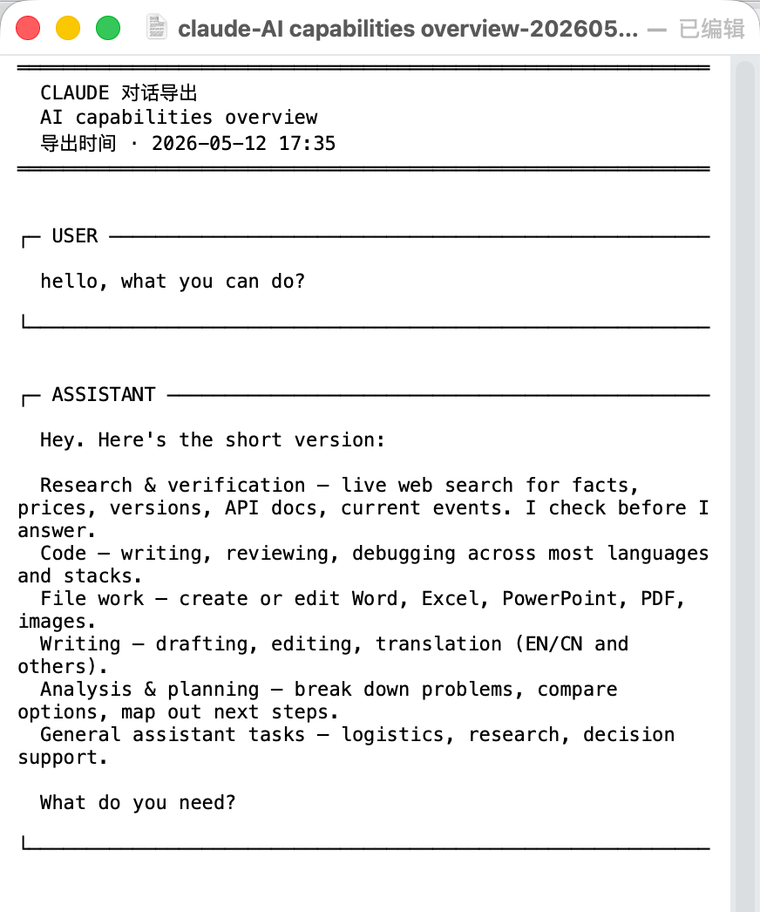

# Claude Chat Exporter


A minimal Firefox extension that adds a button to [Claude.ai](https://claude.ai) for exporting the current conversation to a plain-text `.txt` file.

> ⚠️ This is an unofficial third-party extension. Not affiliated with, endorsed by, or sponsored by Anthropic. "Claude" is a trademark of Anthropic PBC.

## Screenshots

An orange export icon is injected directly below Claude.ai's share button at the top-right of any conversation page:


Clicking it downloads a plain-text `.txt` file with speaker-labelled sections:



## Features

- **One-click export** — A small icon button below Claude.ai's share button turns the open conversation into a downloaded `.txt`.
- **Plain text output** — Paste into any editor, chat, note app, or email. No Markdown, no HTML.
- **Speaker separation** — Each turn is wrapped in a Unicode box labeled `USER` or `ASSISTANT`, easy to scan.
- **Code preserved** — Fenced code blocks are kept with 4-space indentation for monospace readability.
- **No data collection** — Everything happens in your browser. Nothing is uploaded.
- **Tiny footprint** — A single content script (~330 lines), no background page, no remote dependencies.

## Sample output

```
═════════════════════════════════════════════════════════
  Claude Conversation Export
  Why nutrition labels can say "0 sugar" with sugar in
  the ingredients list
  Exported · 2026-05-13 14:22
═════════════════════════════════════════════════════════


┌─ USER ────────────────────────────────────────────────

  Why does the ingredients list have sugar but the
  nutrition label shows 0?

└──────────────────────────────────────────────────────


┌─ ASSISTANT ───────────────────────────────────────────

  Not contradictory — this is a regulated "zero
  threshold" rule. GB 28050 (China) allows labelling
  sugar as 0 g when actual content is below 0.5 g/100 mL...

└──────────────────────────────────────────────────────
```

## Install

### Temporary (for testing)

1. Open `about:debugging#/runtime/this-firefox` in Firefox.
2. Click **Load Temporary Add-on**.
3. Pick a built `.xpi` (see [Building from source](#building-from-source) below).
4. Open any Claude.ai conversation. Click the orange export icon at the top-right.

Temporary add-ons are removed when Firefox restarts.

### Permanent

Three paths — pick whichever fits your browser:

- **Firefox — From GitHub Releases (signed, available now)** — Download the latest `.xpi` from the [releases page](https://github.com/vanawaker/ClaudeChatExporter/releases). Drag it onto a Firefox window, or open `about:addons` → ⚙️ → **Install Add-on From File…**. The release builds are Mozilla-signed, so they install on stable Firefox 140+ with no `about:config` flags.
- **Firefox — From the Mozilla Add-on store (pending review)** — Listed submission to [addons.mozilla.org](https://addons.mozilla.org) is currently under review. Once approved, you'll be able to find and install the extension via Firefox's built-in add-on browser. This README will be updated with the store URL when it goes live.
- **Chrome / Chromium-based — From the Chrome Web Store (pending review)** — Listed submission to the [Chrome Web Store](https://chrome.google.com/webstore) is currently under review. This README will be updated with the store URL when it goes live. Chrome does not support `.crx` / `.zip` sideloading on stable releases, so the store is the only practical install path for regular users.

## Building from source

```sh
cd ClaudeChatExporter
mkdir -p dist
zip -r dist/ClaudeChatExporter.xpi manifest.json content.js icons/ -x "*.DS_Store"
```

No build tools, no dependencies. The `.xpi` is just a zip containing `manifest.json`, `content.js`, and the `icons/` folder at the archive root.

## Compatibility

| Browser | Status |
|---|---|
| Firefox 140+ | Tested |
| Chrome (latest stable) | Tested — same content script, same MV3 manifest, no code changes needed |

## Limitations

Only the **conversation text** is exported. The following are skipped, intentionally, in this version:

- Tool calls
- Extended-thinking traces
- Artifacts (canvas, web previews)
- Message timestamps and model metadata

Each may become an opt-in toggle in a future release.

The selectors rely on Claude.ai's current DOM structure. If Claude.ai redesigns the UI, the extension may break — see [Diagnostics](#diagnostics) below.

## Diagnostics

If the export button finds no messages, open DevTools (F12) → Console and run:

```js
cceDebug()
```

It prints selector hit counts and a reference to the first matched node. If both counts are 0 on a real conversation page, the DOM contract has changed — please [open an issue](https://github.com/vanawaker/ClaudeChatExporter/issues) with the console output.

## License

[MIT](LICENSE) © vanawaker
